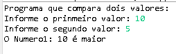

# ComparandoInteirosEmJava

**Comparando Inteiros em Java**

**Programa em Java que compara dois valores e define se qual o maior ou se são iguais**

   

Autor: Erick Leite Freire 
Criado em: 29-12-2023 
Site: [Erick Freire](https://www.erickfreire.com.br) 
